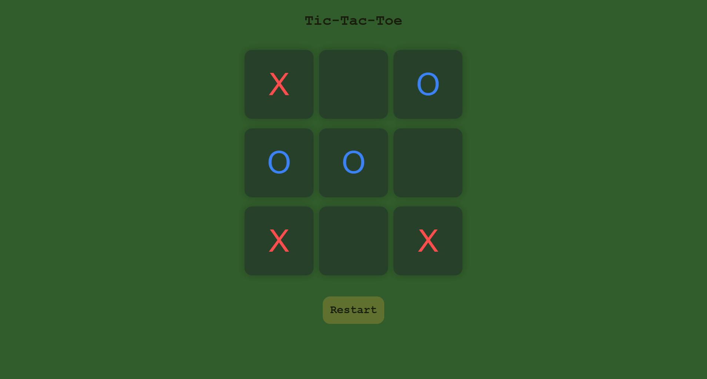

# Tic-Tac-Toe

A responsive and interactive Tic-Tac-Toe game built using HTML, CSS, and JavaScript.

The game provides a simple two-player experience with turn management, winner detection, draw detection, and game reset functionality.

## Live Demo

[Play Tic-Tac-Toe](https://mr-sanket01.github.io/tic-tac-toe/)

## Preview



## Features

- Two-player gameplay
- Separate colors for X and O
- Automatic winner detection
- Draw detection
- Restart game functionality
- New game functionality
- Responsive and clean user interface
- Interactive gameplay using JavaScript

## Technologies Used

- HTML5
- CSS3
- JavaScript (ES6)

## How It Works

The game follows a simple two-player turn-based system:

1. Player X starts the game.
2. Players take turns selecting an empty cell.
3. JavaScript checks each move against the predefined winning combinations.
4. The game displays the winner when a player gets three matching symbols in a row.
5. If all cells are filled without a winner, the game displays a draw.
6. Players can restart or start a new game at any time.

## Project Structure

```text
tic-tac-toe/
│
├── index.html
├── style.css
├── script.js
├── tic-tac-toe.png
└── README.md
```

## Getting Started

### Run Locally

Clone the repository:

```bash
git clone https://github.com/Mr-Sanket01/tic-tac-toe.git
```

Navigate to the project directory:

```bash
cd tic-tac-toe
```

Open `index.html` in your browser.

For development, you can use the **Live Server** extension in VS Code.

## Learning Outcomes

This project helped me practice and understand:

- DOM manipulation
- Event handling
- JavaScript functions
- Arrays and loops
- Conditional statements
- CSS styling and classes
- Game logic implementation
- Git and GitHub workflow

## Future Improvements

- Add a single-player mode with AI
- Add score tracking
- Add difficulty levels
- Add sound effects
- Add additional UI themes
- Improve accessibility

## Author

**Sanket Jadhav**

## Connect with Me

[](https://www.linkedin.com/in/mr-sanket-jadhav-1377x/)

[](https://github.com/Mr-Sanket01)

---

If you like this project, consider giving it a ⭐ on GitHub!
